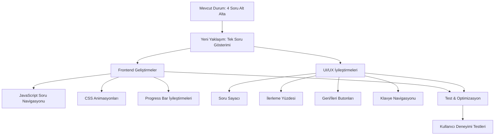
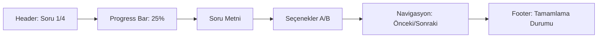

# 📋 MBTI Test Sayfası İyileştirme Planı

## 🎯 Hedefler

### Ana Hedefler
1. **Tek Soru Gösterimi**: Her seferinde sadece bir soru göstermek
2. **Otomatik İlerleme**: Seçenek seçildiğinde bir sonraki soruya geçmek
3. **Gelişmiş Progress Bar**: Daha görsel ve bilgilendirici ilerleme çubuğu
4. **Kullanıcı Dostu Arayüz**: Soru sayısı, tamamlama yüzdesi ve navigasyon

### Mevcut Durum Analizi
- **Şu anki durum**: 4 soru alt alta dizilmiş (E/I, S/N, T/F, J/P)
- **Problem**: Tüm sorular aynı anda görünüyor
- **Hedef**: Tek seferinde bir soru göstermek
- **Mevcut özellikler**: Progress bar, auto-save, form validation

## 🏗️ Teknik Yaklaşım

### Frontend Yaklaşımı (Önerilen)
- Mevcut form yapısını koruyarak JavaScript ile tek soru gösterimi
- CSS ile diğer soruları gizleme
- Smooth geçiş animasyonları
- Geri gitme özelliği

### Avantajları
- Mevcut backend yapısını koruma
- Daha hızlı geliştirme süreci
- SEO dostu (tüm sorular aynı sayfada)
- Auto-save özelliğini koruma

## 📊 İmplementasyon Mimarisi



## 🔧 Detaylı İmplementasyon Adımları

### Adım 1: JavaScript Soru Yöneticisi
**Dosya**: `resources/js/test-interactions.js`

#### QuestionManager Sınıfı Özellikleri:
- **Aktif soru takibi**: Hangi sorunun gösterildiğini takip etme
- **Soru geçiş animasyonları**: Fade in/out efektleri
- **Otomatik ilerleme mantığı**: Seçim yapıldığında otomatik geçiş
- **Geri gitme özelliği**: Önceki sorulara dönebilme

#### Temel Metodlar:
```javascript
class QuestionManager {
    constructor()
    showQuestion(index)
    nextQuestion()
    previousQuestion()
    updateProgress()
    handleAnswerSelection()
}
```

### Adım 2: CSS Güncellemeleri
**Dosya**: `resources/css/components/test-forms.css`

#### Yeni CSS Sınıfları:
- `.question-hidden`: Soruları gizleme
- `.question-active`: Aktif soru stilleri
- `.question-transition`: Geçiş animasyonları
- `.progress-enhanced`: Gelişmiş progress bar

#### Animasyon Özellikleri:
- Fade in/out geçişleri
- Slide animasyonları
- Smooth transitions
- Loading states

### Adım 3: Progress Bar Geliştirmeleri

#### Yeni Özellikler:
- **Daha büyük görsel tasarım**: Daha belirgin progress bar
- **Soru numarası gösterimi**: "Soru 1/4" formatında
- **Tamamlama yüzdesi**: Dinamik yüzde hesaplama
- **Renk geçişleri**: İlerlemeye göre renk değişimi

#### UI Bileşenleri:
```html
<div class="enhanced-progress">
    <div class="progress-header">
        <span class="question-counter">Soru 1/4</span>
        <span class="progress-percentage">25%</span>
    </div>
    <div class="progress-bar-container">
        <div class="progress-bar-fill"></div>
    </div>
</div>
```

### Adım 4: Navigasyon Kontrolleri

#### Yeni Butonlar:
- **"Önceki Soru" butonu**: Geri gitme imkanı
- **"Sonraki Soru" butonu**: Manuel ilerleme (opsiyonel)
- **Klavye kısayolları**: Enter, Space, Arrow keys
- **Soru atlama önleme**: Tüm sorular cevaplanmalı

#### Navigasyon Kuralları:
- İlk soruda "Önceki" butonu gizli
- Son soruda "Sonraki" yerine "Tamamla" butonu
- Cevap verilmeden geçiş yok
- Klavye erişilebilirliği

### Adım 5: Kullanıcı Deneyimi İyileştirmeleri

#### Animasyon Detayları:
- **Soru geçiş animasyonları**: 300ms fade geçişleri
- **Seçim feedback'i**: Seçim yapıldığında görsel geri bildirim
- **Loading states**: Geçiş sırasında loading göstergesi
- **Hata durumu yönetimi**: Geçersiz seçimler için uyarılar

#### Micro-interactions:
- Hover efektleri
- Click feedback
- Progress bar animasyonları
- Success indicators

## 🎨 Yeni Arayüz Tasarımı

### Layout Yapısı:


### Responsive Tasarım:
- **Mobil cihazlar**: Tek sütun düzen, büyük touch butonları
- **Tablet**: Optimized spacing ve font boyutları
- **Desktop**: Merkezi layout, hover efektleri
- **Swipe gesture desteği**: Mobilde sağa/sola kaydırma

## ⚡ Performans Optimizasyonları

### JavaScript Optimizasyonları:
- **Event delegation**: Tek event listener kullanımı
- **Minimal DOM manipülasyonu**: Sadece gerekli değişiklikler
- **CSS transitions**: JavaScript animasyonları yerine CSS
- **Debounced events**: Gereksiz event tetiklemelerini önleme

### CSS Optimizasyonları:
- **Transform kullanımı**: Position değişiklikleri yerine
- **Will-change property**: Animasyon performansı
- **CSS containment**: Layout thrashing önleme
- **Critical CSS**: Sayfa yükleme optimizasyonu

## 🔒 Güvenlik ve Veri Korunması

### Mevcut Özellikleri Koruma:
- **Auto-save functionality**: Local storage ile otomatik kaydetme
- **Session timeout yönetimi**: Oturum süresi kontrolü
- **Form validation**: Client ve server-side doğrulama
- **XSS koruması**: Input sanitization

### Yeni Güvenlik Önlemleri:
- Rate limiting için hazırlık
- CSRF token korunması
- Input validation güçlendirme

## 📈 Gelecek Geliştirmeler

### Kısa Vadeli (1-2 hafta):
- Temel tek soru gösterimi
- Progress bar iyileştirmeleri
- Navigasyon kontrolleri

### Orta Vadeli (1-2 ay):
- **Soru havuzu genişletme**: Daha fazla soru ekleme hazırlığı
- **A/B testing altyapısı**: Farklı UI versiyonları test etme
- **Analytics entegrasyonu**: Kullanıcı davranış analizi

### Uzun Vadeli (3-6 ay):
- **Çoklu dil desteği**: İnternationalization
- **Adaptif test**: Kullanıcı cevaplarına göre soru seçimi
- **AI destekli analiz**: Daha detaylı kişilik analizi

## 🛠️ Kullanılacak Teknolojiler

### Frontend:
- **JavaScript**: ES6+ özellikleri, Class-based yapı
- **CSS**: Flexbox/Grid, CSS Variables, Animations
- **HTML5**: Semantic markup, accessibility

### Backend:
- **Laravel**: Mevcut backend yapısını koruma
- **Blade Templates**: Server-side rendering
- **Session Management**: Kullanıcı durumu takibi

### Storage:
- **Local Storage**: Auto-save functionality
- **MySQL**: Veritabanı işlemleri
- **Session Storage**: Geçici veri saklama

## 📋 Dosya Değişiklikleri

### Güncellenecek Dosyalar:
1. **`resources/views/test/questions.blade.php`**
   - Ana template güncellemesi
   - Yeni progress bar HTML'i
   - Navigasyon butonları ekleme

2. **`resources/js/test-interactions.js`**
   - QuestionManager sınıfı ekleme
   - Mevcut TestPageUtils güncellemesi
   - Event handling iyileştirmeleri

3. **`resources/css/components/test-forms.css`**
   - Yeni stil sınıfları
   - Animasyon tanımları
   - Responsive güncellemeler

4. **`app/Http/Controllers/TestController.php`**
   - Minimal backend değişiklikleri (gerekirse)
   - Session handling iyileştirmeleri

### Yeni Dosyalar (Opsiyonel):
- `resources/js/question-manager.js`: Ayrı soru yönetim modülü
- `resources/css/animations.css`: Animasyon stilleri
- `resources/views/components/progress-bar.blade.php`: Progress bar component

## 🧪 Test Stratejisi

### Unit Tests:
- JavaScript fonksiyon testleri
- CSS animasyon testleri
- Form validation testleri

### Integration Tests:
- Soru geçiş akışı
- Progress bar güncellemeleri
- Auto-save functionality

### User Experience Tests:
- Mobil cihaz testleri
- Accessibility testleri
- Performance testleri

### Browser Compatibility:
- Chrome, Firefox, Safari, Edge
- iOS Safari, Android Chrome
- Keyboard navigation testleri

## 📊 Başarı Metrikleri

### Teknik Metrikler:
- Sayfa yükleme süresi < 2 saniye
- Soru geçiş animasyonu < 300ms
- JavaScript hata oranı < 1%

### Kullanıcı Deneyimi Metrikleri:
- Test tamamlama oranı artışı
- Kullanıcı memnuniyeti skoru
- Mobil kullanım oranı

### Performans Hedefleri:
- Lighthouse Performance Score > 90
- First Contentful Paint < 1.5s
- Cumulative Layout Shift < 0.1

## 🚀 Deployment Planı

### Geliştirme Aşamaları:
1. **Development**: Local geliştirme ve test
2. **Staging**: Test ortamında doğrulama
3. **Production**: Canlı ortama alma

### Rollback Stratejisi:
- Mevcut kod backup'ı
- Feature flag kullanımı
- Hızlı geri alma prosedürü

---

**Son Güncelleme**: 6 Aralık 2025  
**Tahmini Geliştirme Süresi**: 1-2 hafta  
**Zorluk Seviyesi**: Orta  
**Öncelik**: Yüksek