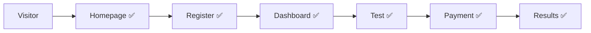

# Script Yönetim Sistemi İyileştirme Planı

## 📊 Mevcut Durum Analizi

### Aktif Script Entegrasyonu
- ✅ **Homepage Layout**: Script'ler `<head>` içinde yükleniyor
- ✅ **Test Layout**: Script'ler `<head>` içinde yükleniyor  
- ❌ **App Layout**: Script entegrasyonu yok
- ❌ **Guest Layout**: Script entegrasyonu yok

### Mevcut Dosyalar
- `app/Settings/GeneralSettings.php` - Script ayarları
- `app/Filament/Pages/Settings.php` - Admin paneli formu
- `resources/views/homepage.blade.php` - Ana sayfa (aktif)
- `resources/views/layouts/test-layout.blade.php` - Test sayfaları (aktif)
- `resources/views/layouts/app.blade.php` - Dashboard sayfaları (pasif)
- `resources/views/layouts/guest.blade.php` - Auth sayfaları (pasif)

## 🎯 Hedefler

### Kısa Vadeli (Aşama 1)
1. **Layout Tutarlılığı**: Tüm layout dosyalarında script desteği
2. **Tam Kapsama**: Analytics/Pixel tracking tüm sayfalarda
3. **User Journey Takibi**: Login → Dashboard → Test → Conversion

### Uzun Vadeli (Aşama 2)
1. **Body Scripts**: Footer script desteği
2. **Conditional Loading**: Sayfa bazında script kontrolü
3. **Performance Optimization**: Script yükleme optimizasyonu

## 🔧 İmplementasyon Planı

### Aşama 1: Layout Tutarlılığı

#### 1.1 App Layout Güncelleme
**Dosya**: `resources/views/layouts/app.blade.php`

```php
// Satır 15'ten sonra ekle:
@php
    $settings = app(App\Settings\GeneralSettings::class);
@endphp

// Satır ~15'te </head> etiketinden önce ekle:
@if($settings->site_custom_scripts)
    {!! $settings->site_custom_scripts !!}
@endif
```

#### 1.2 Guest Layout Güncelleme  
**Dosya**: `resources/views/layouts/guest.blade.php`

```php
// Satır 15'ten sonra ekle:
@php
    $settings = app(App\Settings\GeneralSettings::class);
@endphp

// Satır ~15'te </head> etiketinden önce ekle:
@if($settings->site_custom_scripts)
    {!! $settings->site_custom_scripts !!}
@endif
```

### Etkilenecek Sayfalar

#### App Layout Sayfaları:
- Dashboard (`resources/views/dashboard.blade.php`)
- Profile edit (`resources/views/profile/edit.blade.php`)
- Tüm authenticated user sayfaları

#### Guest Layout Sayfaları:
- Login (`resources/views/auth/login.blade.php`)
- Register (`resources/views/auth/register.blade.php`)
- Password reset (`resources/views/auth/forgot-password.blade.php`)
- Email verification (`resources/views/auth/verify-email.blade.php`)

## 📈 Beklenen Faydalar

### Analytics Takibi


### Facebook Pixel Events
- **PageView**: Tüm sayfalarda
- **CompleteRegistration**: Register sayfasında
- **InitiateCheckout**: Test başlatma
- **Purchase**: Ödeme tamamlama
- **ViewContent**: Sonuç sayfası

### Google Analytics Goals
- **Registration Conversion**: Auth pages → Dashboard
- **Test Completion**: Test start → Test finish
- **Payment Conversion**: Payment page → Success
- **User Engagement**: Dashboard usage patterns

## 🧪 Test Planı

### Implementasyon Sonrası Test
1. **Google Analytics**: Real-time events kontrolü
2. **Facebook Pixel**: Facebook Events Manager kontrolü
3. **Console Errors**: Browser geliştirici araçları kontrolü
4. **Page Load Performance**: Script'lerin sayfa hızına etkisi

### Test Sayfaları
- [ ] Homepage (zaten aktif)
- [ ] Login/Register sayfaları
- [ ] Dashboard sayfası
- [ ] Test sayfaları (zaten aktif)
- [ ] Profile sayfaları

## 🔄 Aşama 2: Body Scripts (Gelecek)

### Potansiyel Kullanım Alanları
- **Conversion Tracking**: Test tamamlama events
- **Exit-Intent Popups**: Sayfa terk etme önleme
- **Chat Widgets**: Intercom, Zendesk entegrasyonu
- **A/B Testing**: Optimize, VWO entegrasyonu
- **Performance Monitoring**: New Relic, Sentry

### Gerekli Değişiklikler
```php
// app/Settings/GeneralSettings.php
public ?string $site_body_scripts;

// Defaults array'ine ekle
'site_body_scripts' => null,

// app/Filament/Pages/Settings.php - Yeni form bölümü
Forms\Components\Section::make('Footer Scripts')
    ->schema([
        Forms\Components\Textarea::make('site_body_scripts')
            ->label('Body Scripts')
            ->rows(10)
            ->helperText('Bu kodlar </body> etiketinden önce yerleştirilir.')
    ]),
```

### Layout Dosyalarına Ekleme
```php
// Tüm layout dosylarında </body> etiketinden önce:
@if($settings->site_body_scripts)
    {!! $settings->site_body_scripts !!}
@endif
```

## ⚠️ Güvenlik Notları

### Mevcut Durum
- **XSS Risk**: Raw HTML output kullanılıyor
- **Input Validation**: Script girişi için validation yok
- **CSP**: Content Security Policy yok

### Risk Değerlendirmesi
- **Risk Seviyesi**: Düşük (sadece admin erişimi)
- **Kullanım**: Tek kişi (site sahibi)
- **Kontrol**: Admin panel erişimi kontrollü

### Gelecek Güvenlik İyileştirmeleri (Opsiyonel)
- HTML Purifier entegrasyonu
- JavaScript syntax validation
- CSP header entegrasyonu
- Script preview modu

## 📋 Aksiyon Planı

### Hemen Yapılacak
- [ ] `app.blade.php` dosyasını güncelle
- [ ] `guest.blade.php` dosyasını güncelle
- [ ] Google Analytics kodu ekle ve test et
- [ ] Facebook Pixel kodu ekle ve test et
- [ ] Tüm sayfalarda script yüklenmesini kontrol et

### Gelecekte Değerlendirilebilir
- [ ] Body scripts özelliği ihtiyacı
- [ ] Performance optimization
- [ ] Advanced analytics setup
- [ ] Conversion tracking refinement

## 🎉 Sonuç

Bu plan ile:
- ✅ **Tam kapsama**: Tüm sayfalarda script desteği
- ✅ **User journey tracking**: Baştan sona takip
- ✅ **Conversion analytics**: Detaylı dönüşüm analizi
- ✅ **Gelecek-proof**: Body scripts için hazır altyapı

## 📞 Implementation Notes

### Kod Değişiklik Lokasyonları
1. **File**: `resources/views/layouts/app.blade.php`
   - **Line**: ~15 (after vite, before </head>)
   - **Action**: Add settings variable and script injection

2. **File**: `resources/views/layouts/guest.blade.php`  
   - **Line**: ~15 (after vite, before </head>)
   - **Action**: Add settings variable and script injection

### Verification Steps
1. Clear cache: `php artisan config:clear`
2. Test Google Analytics in real-time
3. Test Facebook Pixel with Facebook Pixel Helper
4. Check console for JavaScript errors
5. Verify scripts load on all page types

---
**Prepared by**: System Architect  
**Date**: 2025-06-13  
**Version**: 1.0  
**Status**: Ready for Implementation