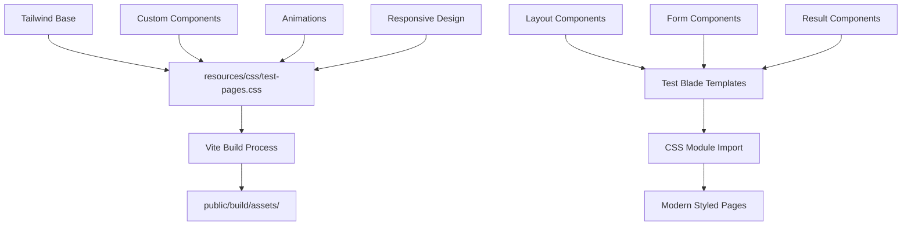

# 🎯 Test Sayfaları Modern CSS Organizasyon Planı

## 📋 Plan Özeti

**Hedef:** Test sayfaları için modern, tutarlı ve maintainable CSS yapısı oluşturmak  
**Yaklaşım:** Ayrı CSS modülü + Vite entegrasyonu + Tailwind CSS hibrit kullanımı  
**Sonuç:** Profesyonel, responsive ve tema uyumlu test sayfaları

---

## 🏗️ Mimari Yapı



---

## 📁 Dosya Organizasyonu

```
resources/
├── css/
│   ├── app.css (mevcut - ana tema)
│   ├── test-pages.css (yeni - test sayfaları)
│   └── components/
│       ├── test-layout.css
│       ├── test-forms.css
│       └── test-results.css
├── views/
│   ├── layouts/
│   │   └── test-layout.blade.php (yeni)
│   └── test/
│       ├── start.blade.php (güncellenecek)
│       ├── questions.blade.php (güncellenecek)
│       └── results.blade.php (güncellenecek)
└── js/
    └── test-interactions.js (yeni)
```

---

## 🎨 CSS Modül Yapısı

### 1. Ana Test CSS Modülü (`resources/css/test-pages.css`)
```css
/* Test sayfaları için özel stiller */
@import 'components/test-layout.css';
@import 'components/test-forms.css';
@import 'components/test-results.css';

/* Test sayfaları genel stilleri */
/* Animasyonlar */
/* Responsive ayarlar */
```

### 2. Component Bazlı CSS Dosyaları
- **test-layout.css**: Genel layout, header, footer, navigation
- **test-forms.css**: Form elementleri, input'lar, button'lar
- **test-results.css**: Sonuç sayfası, skorlar, grafikler

---

## ⚙️ Teknik Implementasyon

### 1. Vite Konfigürasyonu Güncellemesi
```javascript
// vite.config.js
input: [
    'resources/css/app.css',
    'resources/css/test-pages.css', // YENİ
    'resources/js/app.js',
    'resources/js/test-interactions.js' // YENİ
]
```

### 2. Blade Template Yapısı
```php
// Test layout template
@vite(['resources/css/test-pages.css', 'resources/js/test-interactions.js'])
```

### 3. CSS Sınıf Adlandırma Konvansiyonu
```css
/* BEM metodolojisi + test prefix */
.test-container { }
.test-form { }
.test-form__input { }
.test-form__button--primary { }
.test-results { }
.test-results__score-card { }
```

---

## 🎯 Tasarım Sistemi

### Renk Paleti (Mevcut tema ile uyumlu)
- **Primary**: `#4f46e5` (mindmetrics-indigo)
- **Secondary**: `#10B981` (mindmetrics-green)
- **Accent**: `#059669` (mindmetrics-green-dark)
- **Neutral**: Tailwind gray scale

### Typography
- **Font**: Inter (mevcut)
- **Hierarchy**: h1-h6 + body text scales
- **Weight**: 400, 500, 600, 700

### Spacing System
- Tailwind spacing scale kullanımı
- Consistent margin/padding values

---

## 📱 Responsive Stratejisi

```css
/* Mobile First Approach */
.test-container {
    /* Mobile styles */
}

@media (min-width: 768px) {
    /* Tablet styles */
}

@media (min-width: 1024px) {
    /* Desktop styles */
}
```

---

## ✨ Modern UI Features

1. **Smooth Animations**
   - Page transitions
   - Form interactions
   - Progress indicators

2. **Interactive Elements**
   - Hover effects
   - Focus states
   - Loading states

3. **Accessibility**
   - ARIA labels
   - Keyboard navigation
   - Color contrast

4. **Performance**
   - CSS optimization
   - Lazy loading
   - Critical CSS

---

## 🔄 Implementation Sırası

1. **Phase 1**: CSS modül yapısı oluşturma
2. **Phase 2**: Vite konfigürasyonu güncelleme
3. **Phase 3**: Test layout template oluşturma
4. **Phase 4**: Start page styling
5. **Phase 5**: Questions page styling
6. **Phase 6**: Results page styling (mevcut tasarımı geliştirme)
7. **Phase 7**: JavaScript interactions
8. **Phase 8**: Testing ve optimization

---

## 📊 Beklenen Sonuçlar

✅ **Maintainable Code**: Modüler CSS yapısı  
✅ **Performance**: Optimized asset loading  
✅ **Consistency**: Unified design system  
✅ **Scalability**: Easy to extend  
✅ **Modern UX**: Smooth interactions  
✅ **Responsive**: All device support

---

## 🚀 Sonraki Adımlar

Bu plan onaylandıktan sonra, **Code mode**'a geçerek implementation aşamasına başlayabiliriz. Implementation sırasında:

1. Önce CSS modül yapısını oluşturacağız
2. Vite konfigürasyonunu güncelleyeceğiz
3. Test sayfalarını yeni CSS sistemi ile güncelleyeceğiz
4. Modern UI/UX özelliklerini ekleyeceğiz

---

**Not**: Bu plan, Laravel best practices ve modern web development standartlarına uygun olarak hazırlanmıştır. Modüler yapı sayesinde gelecekte kolayca genişletilebilir ve maintain edilebilir.